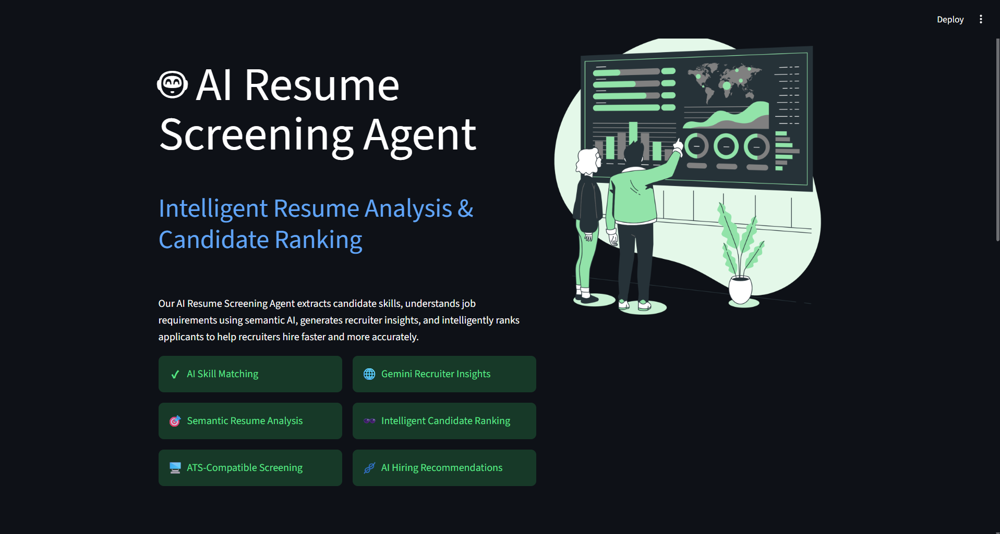
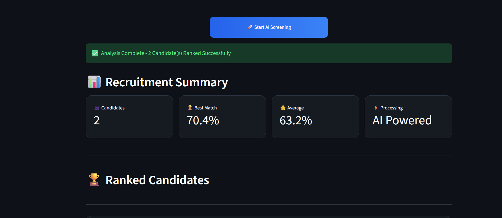
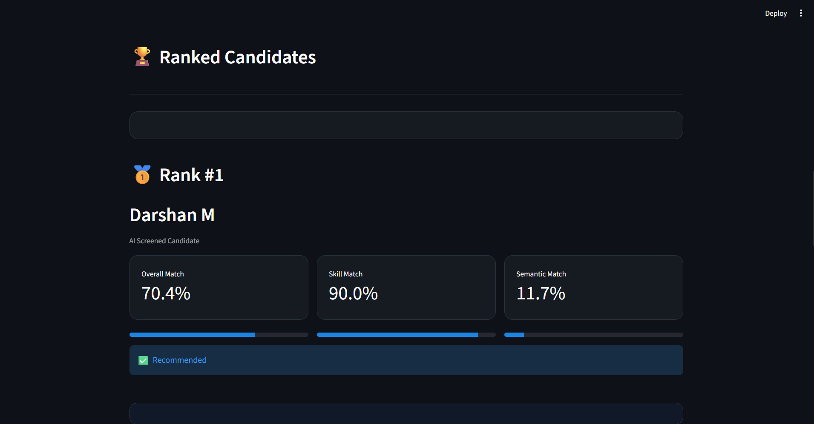
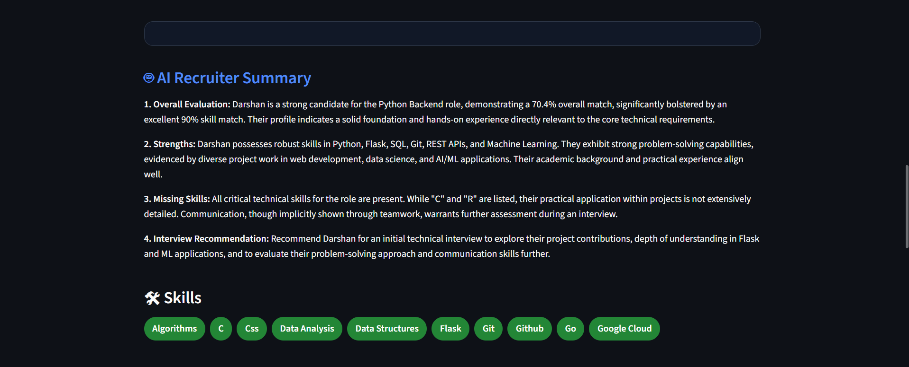

# 🤖 AI Resume Screening Agent

[](https://ai-resume-screening-agent-fn73udascyxegy8ubhrmrn.streamlit.app/)

An AI-powered Resume Screening and Candidate Ranking platform built using **Python, Streamlit, Google Gemini AI, NLP, and Scikit-Learn**.

The application intelligently analyzes resumes against a job description, extracts candidate skills, performs semantic matching, generates recruiter insights using Gemini AI, and ranks applicants based on overall suitability.

---

# ✨ Features

✅ Resume Parsing (PDF/DOCX/TXT)

✅ Job Description Parsing

✅ AI Skill Extraction

✅ Semantic Resume Matching

✅ Recruiter Summary using Gemini AI

✅ Candidate Ranking Dashboard

✅ Match Score Visualization

✅ Multi Resume Screening

---

## 🌐 Live Demo

🚀 **Try the AI Resume Screening Agent here:**

https://ai-resume-screening-agent-fn73udascyxegy8ubhrmrn.streamlit.app/

---

# 🛠 Tech Stack

- Python
- Streamlit
- Google Gemini API
- Scikit-Learn
- TF-IDF Vectorization
- Cosine Similarity
- PyPDF2
- python-docx

---

# 📂 Project Structure

```
AI-Resume-Screening-Agent
│
├── app.py
├── requirements.txt
├── README.md
├── assets/
├── data/
│     sample_jd.txt
├── sample_resumes/
├── output/
├── utils/
└── .env
```

---

# 🚀 Installation

Clone the repository

```bash
git clone https://github.com/YOUR_USERNAME/AI-Resume-Screening-Agent.git
```

Install dependencies

```bash
pip install -r requirements.txt
```

Create a .env file

```
GEMINI_API_KEY=YOUR_GEMINI_API_KEY
```

Run the application

```bash
streamlit run app.py
```

---

# 📋 How It Works

1. Upload a Job Description.
2. Upload one or multiple candidate resumes.
3. Click **Analyze & Rank Candidates**.
4. The system:
   - Extracts resume information
   - Matches skills
   - Calculates semantic similarity
   - Generates AI recruiter insights
   - Ranks candidates
5. Recruiters receive a ranked shortlist with detailed AI explanations.

---

# 📸 Screenshots

## Landing Page



## Recruitment Dashboard



## Candidate Ranking



## AI Recruiter Summary


---

# 📈 Output

The application provides

- Overall Match Score
- Skill Match Score
- Semantic Match Score
- AI Recruiter Summary
- Candidate Ranking
- Skills Overview

---

# 🔮 Future Improvements

- Sentence Transformer Embeddings
- FAISS Vector Search
- Resume Comparison Dashboard
- ATS Resume Score
- Recruiter Chat Assistant

---

# 👨‍💻 Author

Darshan M

GitHub:
https://github.com/DarshanM84

LinkedIn:
https://linkedin.com/in/darshan-m2004